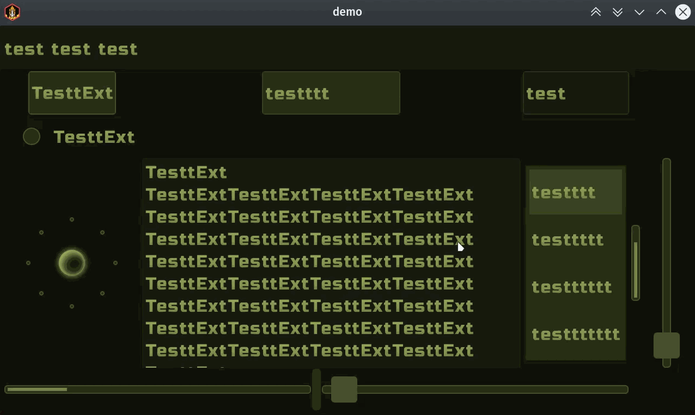
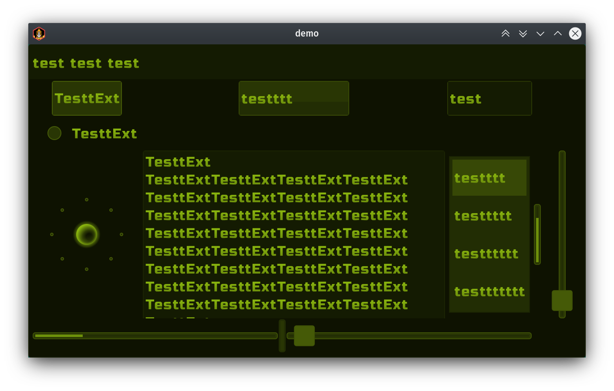
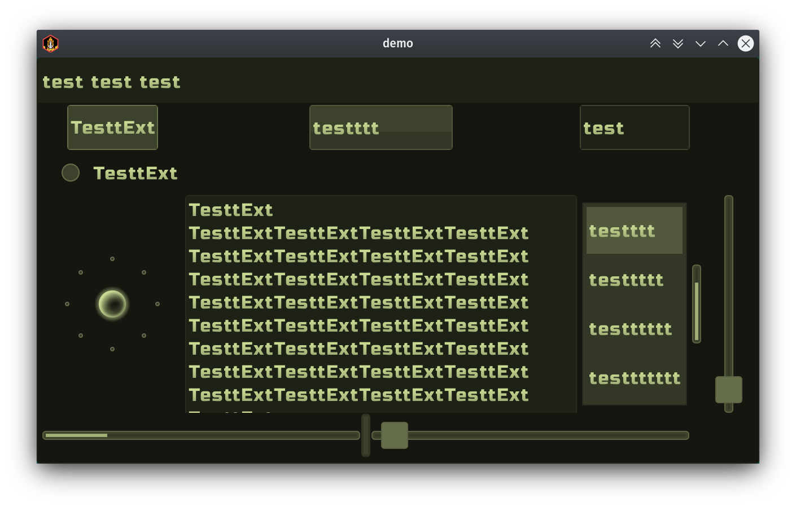
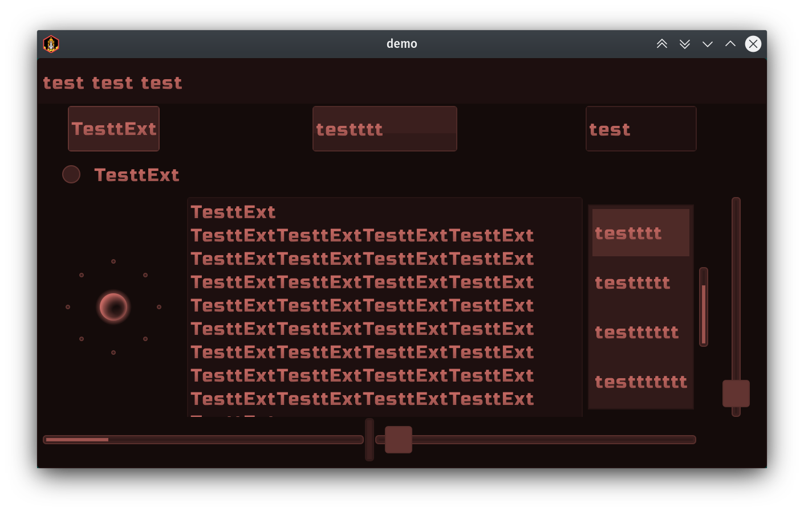
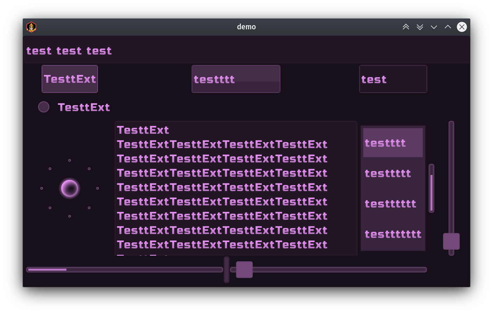

# color-step-libgdx-skin
skin for libgdx , with `multicolor` internal generated styles.  
`Mobile oriented` (80px min high of touchable/clickable elements)

## how much styles prebuilded
Supported internally generated styles is:  
from `hue0dark` to `hue100dark` included  
same for `hue0acid .. hue100acid`  
as for `hue0sun .. hue100sun`  
Every 10 style is gray based `0 10 20 .. 100` .  
Other styles is hue offset based, with manually balanced schemes, to smooth color brightness perception.  

## demonstration
`hue21dark` style demo


`hue21acid` style


`hue21sun` style


`hue20dark` style


`hue1dark` style


`hue81dark` style


`hue81sun` style


## supported libgdx scene2d.ui `Actors`

- ScrollPane 
- SplitPane 
- Touchpad 
- CheckBox 
- Label 
- Button 
- TextButton 
- TextField 
- List
- SelectBox 
- ProgressBar 
- Slider 
- Window 
- Dialog 
- Tree - there is style, but not tested, because i don't know how : ), never use it before and no good kotlin tutorials detected
- TextArea - bugged as official bug(not recommended for using this Actor)

## how to use
- `demo` is libgdx kotlin based project, created using [gdx-liftoff](https://github.com/tommyettinger/gdx-liftoff/releases) tool. Which is more modern, than standard gdx-setup.jar tool.
- clone repo, or download separated folders with included files (which is not so comfort)
- copy folder `/demo/assets/color-step-skin` to your libgdx project assets
- copy folder `core/src/main/kotlin/colorstepskin` to your libgdx core src folder
- `import colorstepskin.ColorStepSkin`
- create your app class property `private val css = ColorStepSkin() //new skin instance`
- prepare skin styles inside `override fun create(){css.prepare()}` before using
- use styles with `Actors` usual way
```kotlin
val button = TextButton("demotext",css,"hue11sun");
```
- or get style from skin instance
```kotlin
val bstyle = css.get("hue10dark", TextButtonStyle::class.java)
val button = TextButton("demotext",bstyle);
```
- is it possible to use short name "hue15", but first you need switch defaul style to `dark`,`acid`,`sun` scheme
```kotlin
css.defaultAcid() //switch short form to acid color scheme
css.defaultSun() //switch short form to sun color scheme
```
- default color scheme preconfigured to `dark` variant in time of creation of `ColorStepSkin` instance
```kotlin
css.defaultDark() //inside ColorStepSkin.kt file
```
