## DEMO - CLICK THE SPOILERS BOTTOM
<details><summary>v1.3 new styles + old restyled</summary>


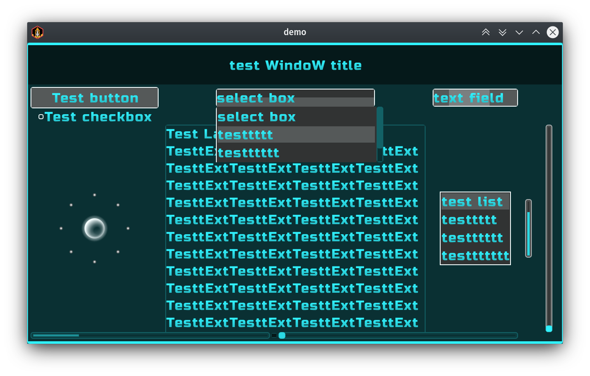


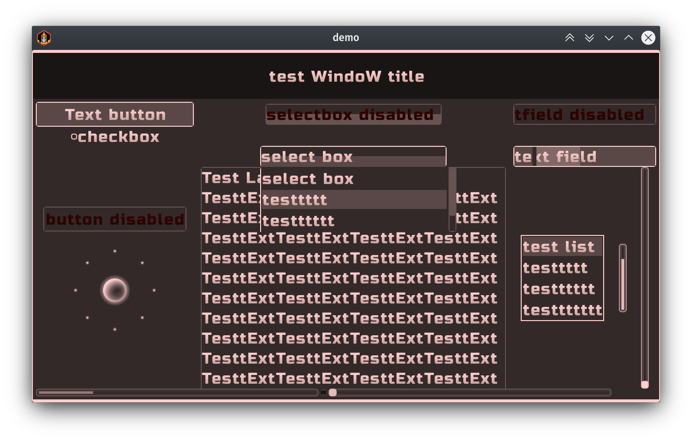


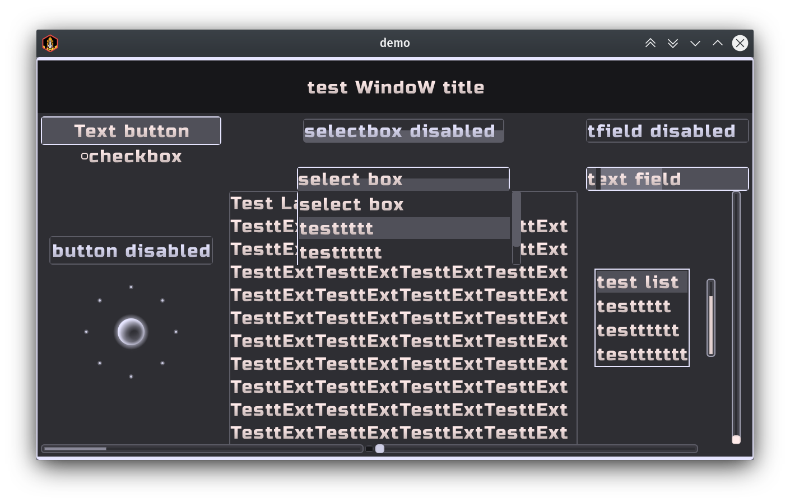


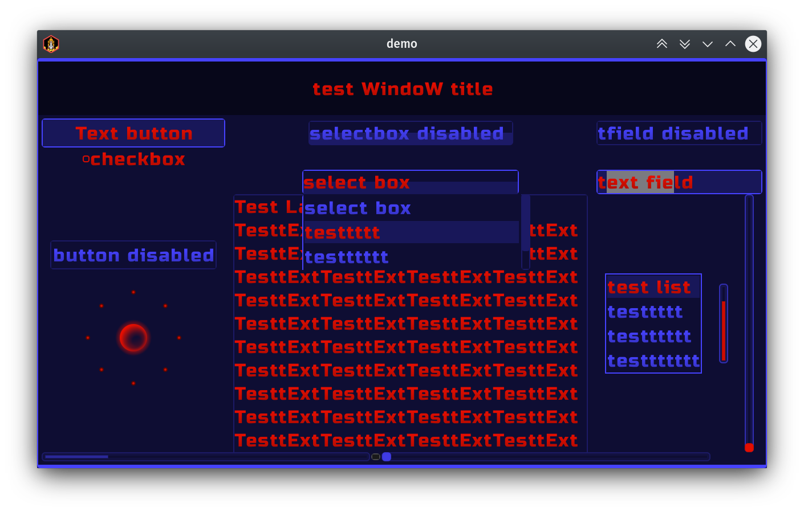

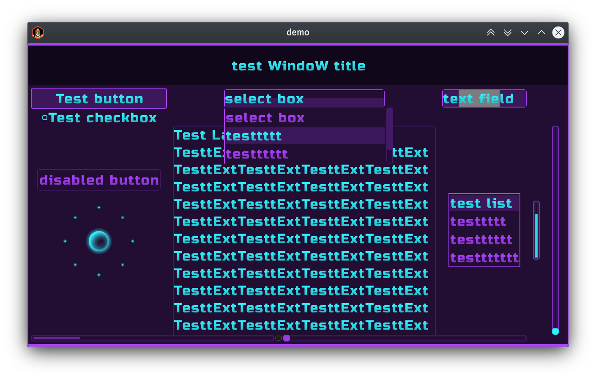

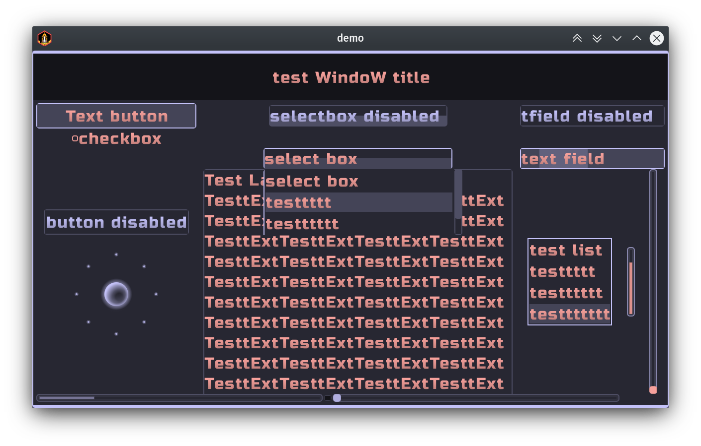


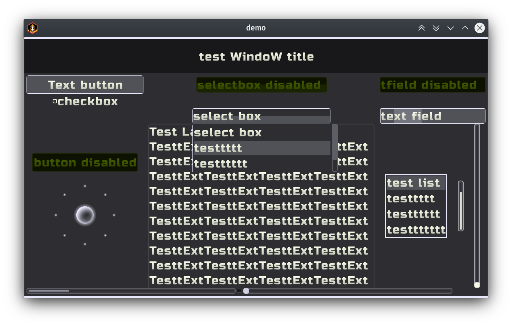


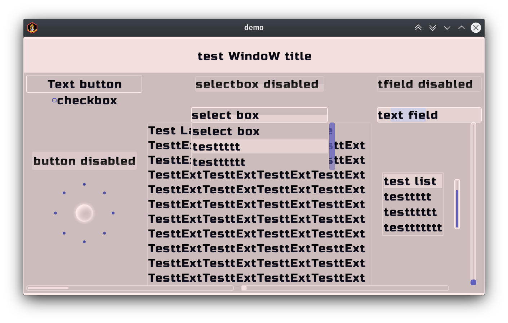
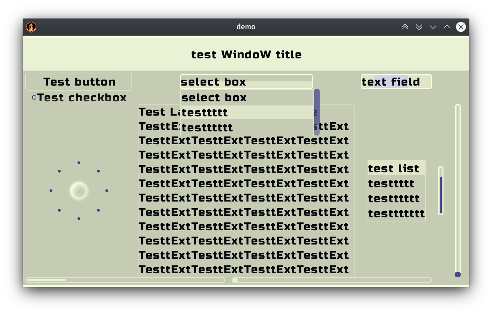


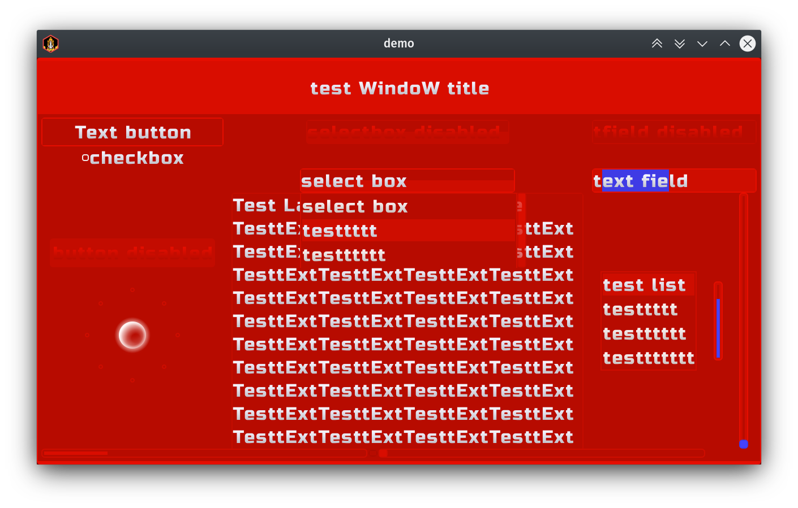
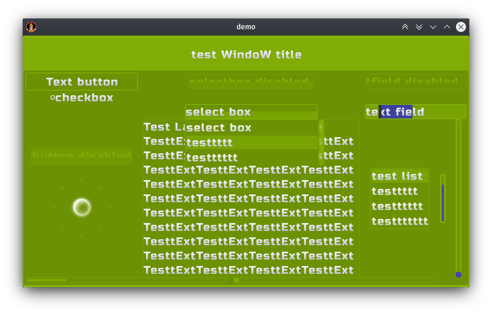


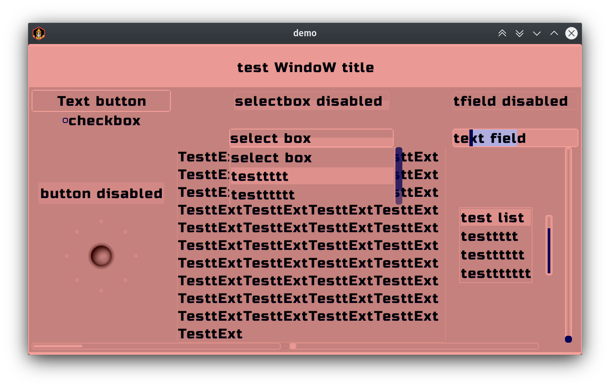


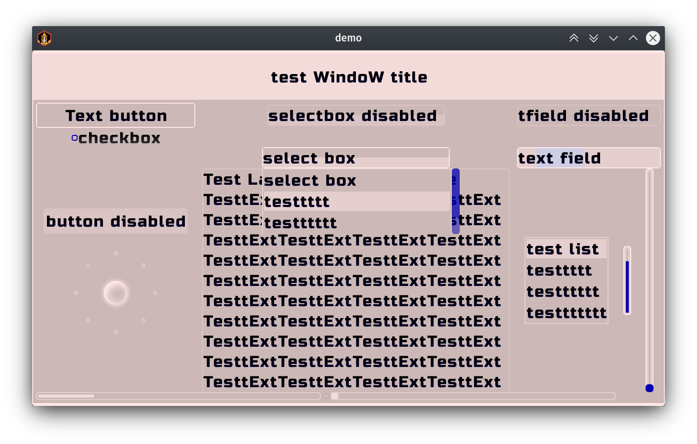


</details>

<details><summary>v1.2 new font sizes</summary>

Available sizes is 8 .. 80 step 4

</details>

<details><summary>v1.1 new styles</summary>


</details>

<details><summary>`hue21dark` old style gif demo</summary>


</details>

<details><summary>old styles</summary>


</details>

---

# color-step-libgdx-skin
skin for [libgdx](https://libgdx.badlogicgames.com/) , with `multicolor` internally generated styles,based on "rainbow color sequence"

## v1.3 [demo13x]
- added two new color schemes `gum` and `snow`
- fully restyled old color schemes `dark` , `acid` , `sun`, include texture atlas (removed restriction to `80px` min size of clickable elements)

## v1.2 [demo12x]
`Mobile oriented` (80px min high of touchable/clickable elements area)

## how much styles prebuilded
Supported internally generated styles is:  
from `hue0dark` to `hue100dark` included  
same for:  
`hue0acid .. hue100acid`  
`hue0sun .. hue100sun`  
`text0dark .. text100dark`  
`text0acid .. text100acid`  
`text0sun .. text100sun`  
`fon0dark .. fon100dark`  
`fon0acid .. fon100acid`  
`fon0sun .. fon100sun`  
Every 10 style is gray based `0 10 20 .. 100` .  
Other styles is hue offset based, with manually balanced schemes, to smooth color brightness perception.  

## supported libgdx scene2d.ui `Actors`

- ScrollPane 
- SplitPane 
- Touchpad 
- CheckBox 
- Label 
- Button 
- TextButton 
- TextField 
- List
- SelectBox 
- ProgressBar 
- Slider 
- Window 
- Dialog 
- Tree - there is style, but not tested, because i don't know how : ), never use it before and no good kotlin tutorials detected
- TextArea - bugged as official bug(not recommended for using this Actor)

## how to use
- `demo` is libgdx kotlin based project, created using [gdx-liftoff](https://github.com/tommyettinger/gdx-liftoff/releases) tool. Which is more modern, than standard gdx-setup.jar tool.
- clone repo, or download separated folders with included files (which is not so comfort)
- copy folder `/demo/assets/color-step-skin` to your libgdx project assets
- copy folder `core/src/main/kotlin/colorstepskin` to your libgdx core src folder
- `import colorstepskin.ColorStepSkin`
- create your app class property `private val css = ColorStepSkin() //new skin instance`
- prepare skin styles inside `override fun create(){css.prepare()}` before using
- use styles with `Actors` usual way
```kotlin
val button = TextButton("demotext",css,"hue11sun");
```
- or get style from skin instance
```kotlin
val bstyle = css.get("hue10dark", TextButtonStyle::class.java)
val button = TextButton("demotext",bstyle);
```
- is it possible to use short name f.e. `15`, but first you need switch default style to
`dark`,`acid`,`sun`,`text dark`,`text acid`,`text sun`,`fon dark`,`fon acid`,`fon sun` scheme
```kotlin
css.defaultDark() //switch short form to dark color scheme
css.defaultAcid() //switch short form to acid color scheme
css.defaultSun() //switch short form to sun color scheme
css.defaultTextDark() //switch short form to text dark color scheme
css.defaultTextAcid() //switch short form to text acid color scheme
css.defaultTextSun() //switch short form to text sun color scheme
css.defaultFonDark() //switch short form to fon dark color scheme
css.defaultFonAcid() //switch short form to fon acid color scheme
css.defaultFonSun() //switch short form to fon sun color scheme
```
- default color scheme preconfigured to `text sun` variant in time of creation of `ColorStepSkin` instance
```kotlin
css.defaultTextSun() //method called inside ColorStepSkin.kt file
```
- after this short name `51` will return style with full name `text51sun`
```kotlin
val bstyle = css.get("51", TextButtonStyle::class.java)
```
- default used font size is `32` , but there is other sizes on the board. Included font letters language is english. Font names inside skin(`css` instance above) is:
  - `font32` used as for `defaultFont`
  - `font8` .. `font80` with step `4`
  - `font32fon` used as for `defaultFontFon`
  - `font8fon` .. `font80fon` with step `4`